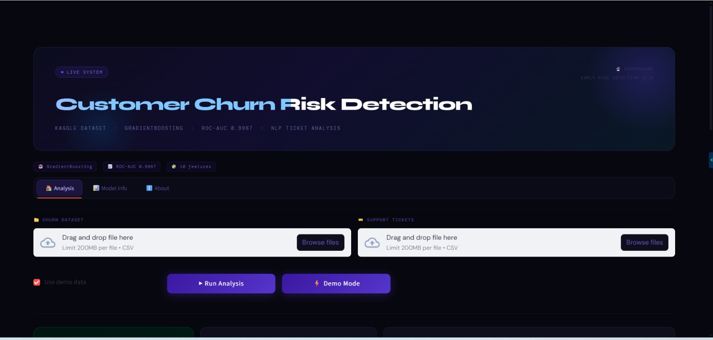
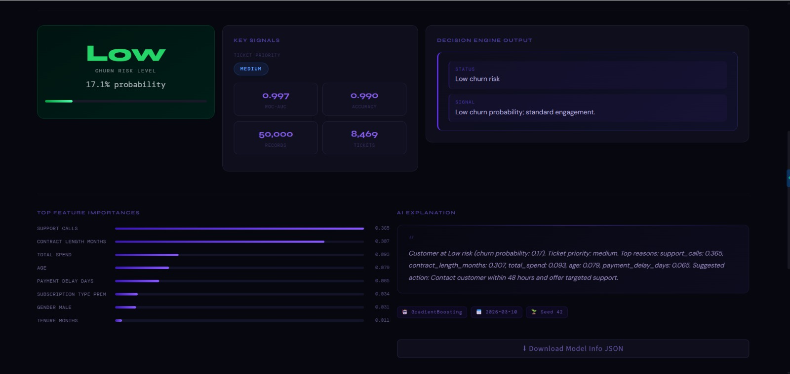
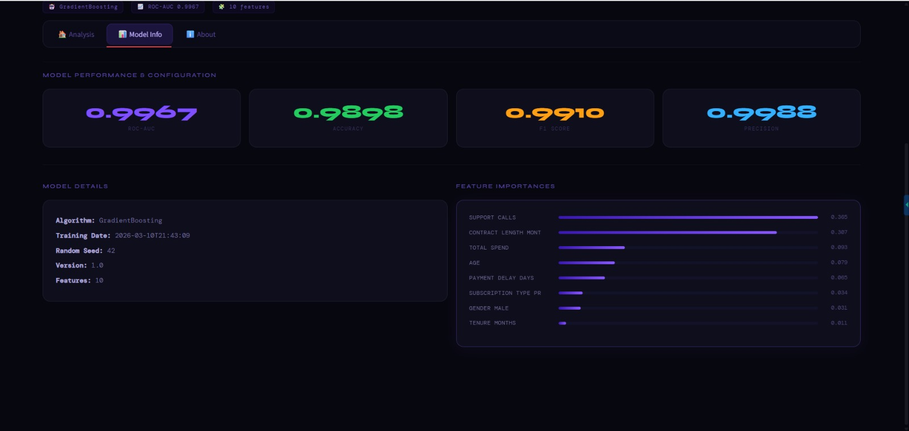
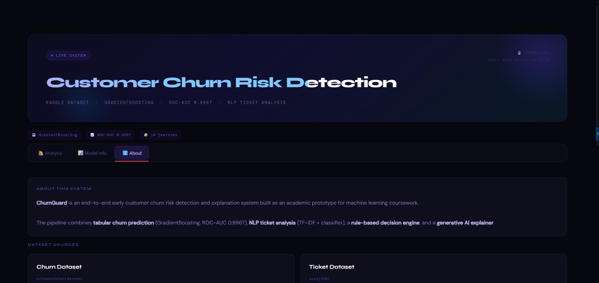
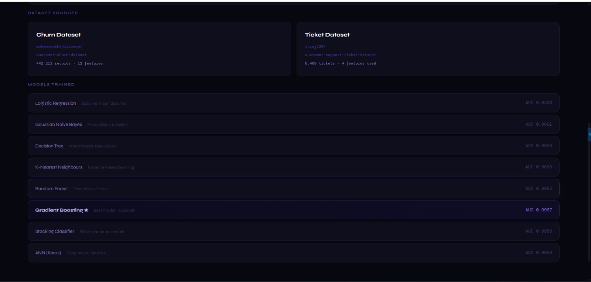

# Early Customer Churn Risk Detection and Explanation System

Academic prototype for **customer churn prediction, support-ticket NLP analysis, risk assessment, and Generative AI-based explanation** through an interactive Streamlit dashboard.

## Project Overview

This project provides an end-to-end system for identifying customers who may be at risk of churn and providing additional context behind the prediction.

The system combines:

* Customer churn data preprocessing and feature transformation
* Multiple machine learning models for churn prediction
* Customer-support ticket NLP analysis
* A rule-based decision engine for risk assessment
* Feature importance and key-signal visualization
* Generative AI-based explanations with a deterministic fallback
* An interactive Streamlit dashboard

### How It Works

The overall workflow is:

**Customer Data → Data Processing → Churn Prediction → Risk Classification → Ticket Analysis → Decision Engine → Feature Insights → GenAI Explanation**

The user can upload a churn dataset through the dashboard and run the analysis. The trained model generates a churn probability, which is converted into a **Low, Medium, or High** risk category.

Support-ticket information can provide additional context about customer issues and ticket priority. The decision engine combines the relevant risk and ticket information to produce a response category.

The dashboard then presents the prediction, important signals, model information, and a human-readable explanation. If an OpenAI API key is unavailable, the application uses a rule-based fallback so that the explanation component can still operate without an API call.

## Dashboard

The Streamlit application is organized into three main sections:

* **Analysis** — Run churn analysis and view risk probability, risk level, key signals, ticket information, decision-engine output, feature importance, and explanation.
* **Model Info** — View model performance metrics, model details, and feature-level information.
* **About** — View an overview of the project, datasets, models, and system components.

## Demonstration

### Dashboard

The main dashboard provides access to **Analysis, Model Info, and About**, along with churn and support-ticket dataset upload options and analysis controls.



### Analysis

The Analysis section presents the predicted churn risk, key signals, ticket priority, model performance, decision-engine output, feature importance, and AI-generated explanation.



### Model Information

The Model Info section displays model performance metrics, configuration details, training information, and feature importance.




### About

The About section provides an overview of the **ChurnGuard system**, including its purpose, datasets, and machine learning models used.

| System Overview                         | Datasets & Models                           |
| --------------------------------------- | ------------------------------------------- |
|  |  |


## Setup

1. **Python 3.10+** required.

2. **Create and activate a virtual environment** (recommended):

   ```bash
   python -m venv venv

   # Windows:
   venv\Scripts\activate

   # Linux/macOS:
   source venv/bin/activate
   ```

3. **Install dependencies**:

   ```bash
   pip install -r requirements.txt
   ```

4. **Download NLTK data** (for NLP pipeline):

   ```bash
   python -c "import nltk; nltk.download('stopwords'); nltk.download('punkt'); nltk.download('punkt_tab')"
   ```

5. **Generate demo data** (if you do not have your own CSVs):

   ```bash
   python data/generate_demo_data.py
   ```

   This creates `data/sample_churn.csv` and `data/sample_tickets.csv`.

## Run Commands

All commands assume you are in the project root (`churn_project/`).

* **Train churn pipeline** (saves model to `models/`):

  ```bash
  python -m src.train_churn
  ```

* **Train NLP pipeline** (saves model and vectorizer to `models/`):

  ```bash
  python -m src.train_nlp
  ```

* **Start Streamlit dashboard**:

  ```bash
  streamlit run app/app.py
  ```

All scripts exit with non-zero status on failure and print helpful logs.

## Unit Tests

```bash
# From project root (churn_project/)
make test

# or
pytest tests/ -v
```

Requires `pytest` (install via `pip install -r requirements.txt` if you add pytest to requirements).

## Data Schemas

### Churn CSV (Dataset 1)

* Expected columns (synonyms allowed; mapping can be saved to `data/column_mapping.json`):

  * `customer_id` (optional), `age`/`customer_age`, `gender`/`customer_gender`, `tenure_months`/`tenure`, `monthly_usage_hours`/`usage_frequency`/`avg_session_time`, `support_calls`/`num_support_calls`, `payment_delay_days`/`payment_delay`, `subscription_type`/`plan`, `contract_length_months`/`contract_length`, `total_spend`/`lifetime_value`, `last_interaction_date` (ISO), **`churn`** (Yes/No, 1/0, true/false) — **mandatory**.

### Ticket CSV (Dataset 2)

* Expected: `ticket_id`, `customer_id` (optional), `ticket_subject`, `ticket_description`, `ticket_priority` (low/medium/high/critical).
* If `ticket_priority` is missing, synthetic priority is created via keyword rules (see `NOTES.md`).

## OpenAI / Generative AI Explainer

* If `OPENAI_API_KEY` is set in the environment, the explainer uses OpenAI for 2–3 sentence explanations.
* If the key is **not** set, a **deterministic rule-based fallback** is used (no API call). The app never fails due to a missing API key.
* To enable OpenAI, set `OPENAI_API_KEY` in your environment or in a `.env` file. **Do not commit API keys.**

## Project Structure

```text
churn_project/

├── app/
│   └── app.py              # Streamlit dashboard
├── data/
│   ├── column_mapping.json # Optional column mapping
│   ├── generate_demo_data.py
│   ├── sample_churn.csv
│   └── sample_tickets.csv
├── logs/
│   └── app.log
├── models/                 # Saved models, scaler, vectorizer, *_info.json
├── notebooks/              # lab1_eda through lab12_genai
├── reports/                # EDA plots, classification reports, ROC, summary.md
├── src/
│   ├── data_processing.py
│   ├── regression_models.py
│   ├── classification_models.py
│   ├── ensemble_models.py
│   ├── clustering.py
│   ├── ann_model.py
│   ├── nlp_model.py
│   ├── decision_engine.py
│   ├── genai_explainer.py
│   ├── load_models.py
│   ├── train_churn.py
│   └── train_nlp.py
├── tests/
│   ├── test_data_processing.py
│   ├── test_decision_engine.py
│   └── test_genai_explainer.py
├── requirements.txt
├── pytest.ini
├── README.md
└── NOTES.md
```

## Reproducibility

* Random seed `42` is used for numpy, random, sklearn, and TensorFlow throughout the project.
